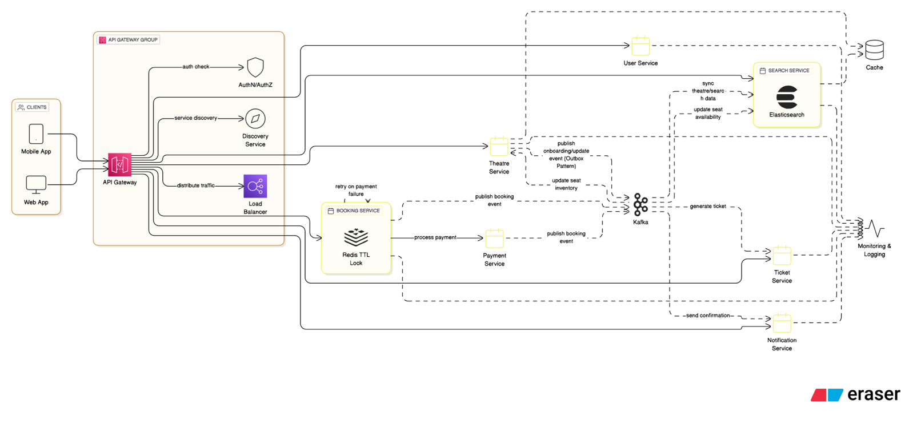

# Movie Booking System - and Microservices Architecture

A robust, scalable movie ticket booking platform built using Spring Boot microservices architecture and Domain-Driven Design (DDD) principles.

## System Architecture




The system is composed of multiple microservices, each handling specific business capabilities:

```
                                   ┌─────────────────┐
                                   │  Eureka Server  │
                                   └────────┬────────┘
                                           │
                                   ┌───────┴────────┐
                                   │  API Gateway   │
                                   └───────┬────────┘
                     ┌────────────────────┬┴─────────────────────┐
              ┌──────┴──────┐      ┌─────┴─────┐         ┌──────┴──────┐
              │ User Service│      │Movie Service│        │Theatre Service│
              └─────────────┘      └─────────────┘        └──────┬──────┘
                                                                 │
                                                         ┌───────┴───────┐
                                                         │Booking Service│
                                                         └───────┬───────┘
                                                    ┌───────────┴────────────┐
                                              ┌─────┴─────┐          ┌──────┴───────┐
                                              │Payment Service│       │Notification Service│
                                              └─────────────┘         └────────────────┘
```

## Technology Stack

- **Framework**: Spring Boot 3.2+, Spring Cloud 2023.0+
- **Database**: PostgreSQL (primary), Redis (caching), Elasticsearch (search)
- **Message Broker**: Apache Kafka
- **Service Discovery**: Netflix Eureka
- **Monitoring**: Prometheus, Grafana
- **Documentation**: OpenAPI 3 (Swagger)
- **Testing**: JUnit 5, Testcontainers

## Project Structure

```
movie-booking-system/
├── api-gateway/               # API Gateway Service
├── booking-service/          # Booking Management Service
├── common-lib/              # Shared Library
├── discovery-service/       # Eureka Service Discovery
├── movie-service/          # Movie Catalog Service
├── notification-service/    # Notification Service
├── payment-service/         # Payment Processing Service
├── theatre-service/        # Theatre Management Service
└── user-service/           # User Management Service
```

## Prerequisites

- Java 17+
- Maven 3.8+
- Docker & Docker Compose
- Git

## Local Development Setup

For detailed setup instructions, sample API calls, and testing procedures, see [LOCAL_SETUP.md](LOCAL_SETUP.md)

Quick Start:

1. Clone the repository:
   ```bash
   git clone <repository-url>
   cd movie-booking-system
   ```

2. Install prerequisites (PostgreSQL, Redis, Kafka, Elasticsearch):
   ```bash
   # Using provided script
   ./scripts/install-prerequisites.sh
   ```

3. Start infrastructure services:
   ```bash
   docker compose up -d
   ```

4. Build all services:
   ```bash
   ./mvnw clean install
   ```

5. Start all services in correct order:
   ```bash
   # Using provided script
   ./start-services.sh
   ```

6. Verify setup at http://localhost:8761 (Eureka Dashboard)

## Detailed Service Descriptions

### 1. Discovery Service (Port: 8761)
- Service registry and discovery using Netflix Eureka
- Enables dynamic service registration and discovery
- Dashboard available at: http://localhost:8761

### 2. API Gateway (Port: 8080)
- Single entry point for all client requests
- Features:
  - Route management
  - Authentication & Authorization
  - Rate limiting
  - Request/Response transformation
  - Circuit breaking
- All API endpoints are prefixed with `/api/v1`

### 3. User Service (Port: 8081)
- Handles user management and authentication
- Key Features:
  - User registration and login
  - JWT token generation and validation
  - User profile management
- Key Endpoints:
  - POST `/api/v1/auth/register`: User registration
  - POST `/api/v1/auth/login`: User authentication
  - GET `/api/v1/users/profile`: Get user profile
  - PUT `/api/v1/users/profile`: Update user profile

### 4. Movie Service (Port: 8082)
- Manages movie catalog and information
- Key Features:
  - Movie CRUD operations
  - Advanced search functionality using Elasticsearch
  - Movie ratings and reviews
- Key Endpoints:
  - GET `/api/v1/movies`: List all movies
  - GET `/api/v1/movies/search`: Search movies
  - GET `/api/v1/movies/{id}`: Get movie details
  - POST `/api/v1/movies/{id}/reviews`: Add movie review

### 5. Theatre Service (Port: 8083)
- Manages theatres and show schedules
- Key Features:
  - Theatre management
  - Screen management
  - Show scheduling
  - Seat layout management
- Key Endpoints:
  - GET `/api/v1/theatres`: List theatres
  - GET `/api/v1/theatres/{id}/shows`: Get theatre shows
  - GET `/api/v1/shows/{id}/seats`: Get show seat layout

### 6. Booking Service (Port: 8084)
- Handles ticket booking and seat management
- Key Features:
  - Seat selection and locking
  - Booking workflow management
  - Integration with payment service
- Key Endpoints:
  - POST `/api/v1/bookings`: Create booking
  - GET `/api/v1/bookings/{id}`: Get booking details
  - PUT `/api/v1/bookings/{id}/cancel`: Cancel booking

### 7. Payment Service (Port: 8085)
- Manages payment processing
- Key Features:
  - Payment processing
  - Multiple payment method support
  - Payment status tracking
- Key Endpoints:
  - POST `/api/v1/payments`: Process payment
  - GET `/api/v1/payments/{id}`: Get payment status

### 8. Notification Service (Port: 8086)
- Handles system notifications
- Key Features:
  - Email notifications
  - Event-driven architecture using Kafka
  - HTML email templates
- Key Endpoints:
  - POST `/api/v1/notifications`: Send notification
  - GET `/api/v1/notifications/user/{userId}`: Get user notifications

## Infrastructure Services

- PostgreSQL: 5432
- Redis: 6379
- Elasticsearch: 9200
- Kafka: 9092
- Prometheus: 9090
- Grafana: 3000

## Monitoring & Management

1. Service Registry (Eureka):
   - Dashboard: http://localhost:8761

2. Prometheus:
   - Dashboard: http://localhost:9090

3. Grafana:
   - Dashboard: http://localhost:3000
   - Default credentials: admin/admin123

## API Documentation

Each service's API documentation is available at:
```
http://localhost:{service-port}/swagger-ui.html
```

## Testing
Each service includes:
- Unit Tests
- Integration Tests
- API Tests using RestAssured
- Performance Tests using JMeter

To run tests:
```bash
# Run unit tests
./mvnw test

# Run integration tests
./mvnw verify -P integration-test

# Run all tests including performance tests
./mvnw verify -P all-tests
```

## Monitoring & Observability
- Each service exposes metrics via Spring Actuator
- Prometheus scrapes metrics from all services
- Grafana dashboards for visualization
- Key metrics monitored:
  - Service health & availability
  - Response times and latency
  - Error rates and types
  - JVM metrics (memory, threads, GC)
  - Business metrics (bookings, payments)
  - Database connection pool
  - Cache hit/miss ratios

## Security Measures
- JWT-based authentication
- Role-based access control (RBAC)
- API Gateway security policies
- SSL/TLS encryption
- Rate limiting per user/IP
- Input validation and sanitization
- XSS protection
- CORS configuration
- Secure password hashing
- Audit logging

## Deployment
- Containerized using Docker
- Kubernetes manifests provided
- CI/CD pipeline using GitHub Actions
- Environment-specific configurations
- Centralized logging with ELK stack
- Automated database migrations
- Blue-green deployment support
- Service mesh ready

## Contributing
1. Fork the repository
2. Create a feature branch
3. Implement your changes
4. Add/update tests
5. Update documentation
6. Submit a pull request

## Troubleshooting
Common issues and solutions:
1. Services not registering with Eureka:
   - Check if Eureka server is running
   - Verify network connectivity
   - Check service configurations

2. Database connection issues:
   - Verify PostgreSQL is running
   - Check connection credentials
   - Validate database exists

3. Kafka connectivity:
   - Ensure Kafka broker is running
   - Check topic configurations
   - Verify consumer group IDs

## License
This project is licensed under the MIT License - see the LICENSE file for details

## Support
For bug reports and feature requests:
- Create an issue in the GitHub repository
- Contact the maintainers
- Check the documentation

---
Last Updated: September 2025
